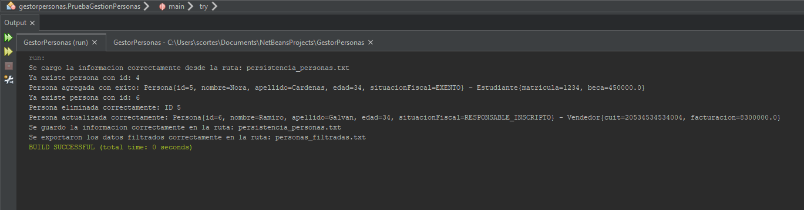

# Gestión de Personas – Final Programación 2

## Descripción

En este proyecto nos enfocamos en aplicar conceptos de programación orientada a objetos, tales como herencia, abstracción, encapsulamiento y polimorfismo.

Se desarrollo un sistema de gestion por consola de personas escrito en JAVA 21, que consta de alta, baja modificacion y ademas persistencia de distintos tipos de personas en archivo .txt con serialización.

## Requisitos

- Java 21 O superior

- Ejecutar archivo PruebaGestionPersonas.java

## Modelo UML


## Ejemplo de utilización

### Corriendo la siguiente porción de código obtenemos los resultados descriptos en las capturas de mas abajo.

```java
// Instanciamos repositorio de txt
Repositorio repositorioTxt = new RepositorioTXT();

// Rutas de archivos txts
String rutaLecturaEscritura = "persistencia_personas.txt";
String rutaFiltrados = "personas_filtradas.txt";

// Instanciamos el sistema de gestion de personas
GestionPersonas manager = new GestionPersonas(repositorioTxt, rutaLecturaEscritura, rutaFiltrados);

// Creamos personas
Persona p1 = new Empleado(
        2543,
        25000,
        4,
        "Pablo",
        "Ramirez",
        34,
        SituacionFiscal.MONOTRIBUTO
);
Persona p2 = new Estudiante(
        1234,
        450000,
        5,
        "Nora",
        "Cardenas",
        34,
        SituacionFiscal.EXENTO
);
Persona p3 = new Vendedor(
        "20534534534004",
        8300000,
        6,
        "Ramiro",
        "Gonzalez",
        34,
        SituacionFiscal.RESPONSABLE_INSCRIPTO
);

// Agregamos personas al manager
manager.agregar(p1);
manager.agregar(p2);
manager.agregar(p3);

// Eliminamos
manager.eliminar(p2.getId());

// Actualizamos
Persona modificada = p3;
modificada.setApellido("Galvan");
manager.actualizar(modificada);

// Guardamos en persistencia txt
manager.guardarPersonas();

// Exportamos Personas filtradas en txt
manager.exportarFiltrado(p -> p instanceof Vendedor);
```

### Capturas




-----------------------------------------------------------

### ALUMNO CORTES SANTIAGO - LEGAJO 116252 - 2025
